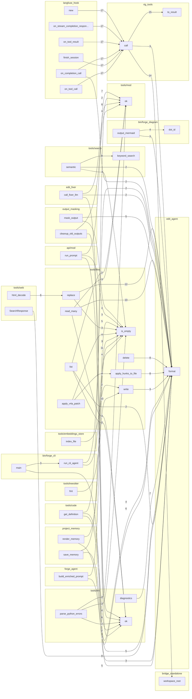

```mermaid
graph LR

  subgraph api_mod["api/mod"]
    api_mod__run_prompt["run_prompt" ]
  end
  subgraph bin_forge_cli["bin/forge_cli"]
    bin_forge_cli__main["main" ]
    bin_forge_cli__run_cli_agent["run_cli_agent" ]
  end
  subgraph bin_forge_diagram["bin/forge_diagram"]
    bin_forge_diagram__dot_id["dot_id" ]
    bin_forge_diagram__output_mermaid["output_mermaid" ]
  end
  subgraph bridge_standalone["bridge_standalone"]
    bridge_standalone__workspace_root["workspace_root" ]
  end
  subgraph edit_agent["edit_agent"]
    edit_agent__format["format" ]
  end
  subgraph edit_fixer["edit_fixer"]
    edit_fixer__call_fixer_llm["call_fixer_llm" ]
  end
  subgraph forge_agent["forge_agent"]
    forge_agent__build_enriched_prompt["build_enriched_prompt" ]
  end
  subgraph langfuse_hook["langfuse_hook"]
    langfuse_hook__new["new" ]
    langfuse_hook__new["new" ]
    langfuse_hook__finish_session["finish_session" ]
    langfuse_hook__finish_session["finish_session" ]
    langfuse_hook__on_completion_call["on_completion_call" ]
    langfuse_hook__on_stream_completion_response_finish["on_stream_completion_respon..." ]
    langfuse_hook__on_tool_call["on_tool_call" ]
    langfuse_hook__on_tool_result["on_tool_result" ]
  end
  subgraph output_masking["output_masking"]
    output_masking__mask_output["mask_output" ]
    output_masking__cleanup_old_outputs["cleanup_old_outputs" ]
  end
  subgraph project_memory["project_memory"]
    project_memory__render_memory["render_memory" ]
    project_memory__save_memory["save_memory" ]
  end
  subgraph rig_tools["rig_tools"]
    rig_tools__to_result["to_result" ]
    rig_tools__call["call" ]
    rig_tools__call["call" ]
    rig_tools__call["call" ]
    rig_tools__call["call" ]
    rig_tools__call["call" ]
    rig_tools__call["call" ]
    rig_tools__call["call" ]
    rig_tools__call["call" ]
    rig_tools__call["call" ]
    rig_tools__call["call" ]
    rig_tools__call["call" ]
    rig_tools__call["call" ]
    rig_tools__call["call" ]
    rig_tools__call["call" ]
    rig_tools__call["call" ]
    rig_tools__call["call" ]
    rig_tools__call["call" ]
  end
  subgraph tools_code["tools/code"]
    tools_code__get_definition["get_definition" ]
  end
  subgraph tools_embeddings_store["tools/embeddings_store"]
    tools_embeddings_store__index_file["index_file" ]
  end
  subgraph tools_files["tools/files"]
    tools_files__write["write" ]
    tools_files__replace["replace" ]
    tools_files__delete["delete" ]
    tools_files__list["list" ]
    tools_files__read_many["read_many" ]
    tools_files__apply_v4a_patch["apply_v4a_patch" ]
    tools_files__is_empty["is_empty" ]
    tools_files__apply_hunks_to_file["apply_hunks_to_file" ]
  end
  subgraph tools_lint["tools/lint"]
    tools_lint__diagnostics["diagnostics" ]
    tools_lint__ok["ok" ]
    tools_lint__parse_python_errors["parse_python_errors" ]
  end
  subgraph tools_mod["tools/mod"]
    tools_mod__ok["ok" ]
  end
  subgraph tools_search["tools/search"]
    tools_search__semantic["semantic" ]
    tools_search__keyword_search["keyword_search" ]
  end
  subgraph tools_treesitter["tools/treesitter"]
    tools_treesitter__fmt["fmt" ]
  end
  subgraph tools_web["tools/web"]
    tools_web__SearchResponse["SearchResponse" ]
    tools_web__html_decode["html_decode" ]
  end

  edit_fixer__call_fixer_llm -->|"6"| tools_lint__ok
  langfuse_hook__new -->|"17"| rig_tools__call
  output_masking__cleanup_old_outputs -->|"4"| tools_lint__ok
  langfuse_hook__on_stream_completion_response_finish -->|"17"| rig_tools__call
  tools_files__replace -->|"12"| edit_agent__format
  langfuse_hook__on_tool_result -->|"17"| rig_tools__call
  tools_search__semantic -->|"2"| edit_agent__format
  tools_web__html_decode -->|"6"| tools_files__replace
  output_masking__mask_output -->|"2"| tools_files__is_empty
  langfuse_hook__on_completion_call -->|"2"| edit_agent__format
  api_mod__run_prompt -->|"7"| tools_mod__ok
  bin_forge_cli__run_cli_agent -->|"2"| edit_agent__format
  rig_tools__call -->|"3"| edit_agent__format
  edit_fixer__call_fixer_llm -->|"2"| edit_agent__format
  tools_files__read_many -->|"3"| tools_lint__ok
  tools_files__apply_v4a_patch -->|"4"| tools_files__apply_hunks_to_file
  tools_files__read_many -->|"10"| edit_agent__format
  bin_forge_diagram__output_mermaid -->|"4"| bin_forge_diagram__dot_id
  tools_search__semantic -->|"8"| tools_search__keyword_search
  tools_lint__parse_python_errors -->|"2"| tools_lint__ok
  output_masking__mask_output -->|"5"| edit_agent__format
  tools_lint__parse_python_errors -->|"2"| tools_files__is_empty
  api_mod__run_prompt -->|"3"| tools_files__is_empty
  tools_code__get_definition -->|"2"| tools_lint__ok
  tools_files__delete -->|"8"| edit_agent__format
  tools_files__apply_hunks_to_file -->|"8"| edit_agent__format
  project_memory__render_memory -->|"5"| tools_files__is_empty
  langfuse_hook__on_completion_call -->|"17"| rig_tools__call
  tools_files__write -->|"3"| edit_agent__format
  tools_files__list -->|"2"| tools_mod__ok
  tools_search__semantic -->|"3"| tools_files__is_empty
  project_memory__save_memory -->|"4"| edit_agent__format
  tools_embeddings_store__index_file -->|"2"| tools_files__write
  tools_treesitter__fmt -->|"10"| tools_files__write
  forge_agent__build_enriched_prompt -->|"6"| edit_agent__format
  tools_code__get_definition -->|"2"| tools_mod__ok
  tools_files__replace -->|"3"| tools_files__is_empty
  tools_files__list -->|"2"| tools_lint__ok
  tools_lint__diagnostics -->|"7"| edit_agent__format
  tools_lint__parse_python_errors -->|"2"| tools_mod__ok
  tools_files__apply_v4a_patch -->|"4"| tools_files__is_empty
  tools_code__get_definition -->|"5"| edit_agent__format
  edit_fixer__call_fixer_llm -->|"6"| tools_mod__ok
  bin_forge_diagram__output_mermaid -->|"3"| edit_agent__format
  langfuse_hook__finish_session -->|"17"| rig_tools__call
  rig_tools__call -->|"15"| rig_tools__to_result
  project_memory__save_memory -->|"3"| tools_files__is_empty
  tools_web__SearchResponse -->|"8"| edit_agent__format
  output_masking__cleanup_old_outputs -->|"4"| tools_mod__ok
  tools_files__list -->|"2"| edit_agent__format
  forge_agent__build_enriched_prompt -->|"11"| tools_files__is_empty
  langfuse_hook__on_tool_call -->|"17"| rig_tools__call
  tools_files__read_many -->|"3"| tools_mod__ok
  bin_forge_cli__main -->|"3"| bin_forge_cli__run_cli_agent
  rig_tools__call -->|"14"| bridge_standalone__workspace_root
  api_mod__run_prompt -->|"7"| tools_lint__ok
  project_memory__render_memory -->|"3"| edit_agent__format
  bin_forge_cli__main -->|"5"| edit_agent__format
  bin_forge_cli__run_cli_agent -->|"4"| tools_files__is_empty
```
